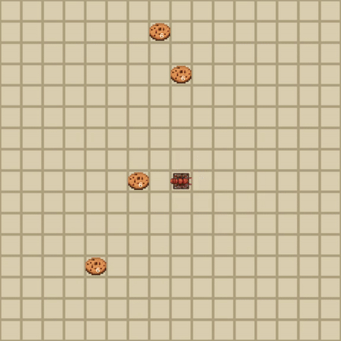

# Ant Byte Foraging

`AntByteForagingEnv` is a Gymnasium gridworld where a centralized controller
moves several ants, lets each ant read the writable value stored on its current
tile, and lets each ant overwrite that tile value. Ants bite food from a source,
carry one bite at a time, and drop it at the colony hub.

The environment is rendered with Pygame and supports `render_mode="human"` and
`render_mode="rgb_array"`.

## Install

```bash
python -m pip install -e ".[dev]"
```

For NVIDIA GPU training on a CUDA 13-capable driver, install the CUDA JAX extra:

```bash
python -m pip install -e ".[jax-cuda13,notebooks]"
```

Then verify that JAX sees the GPU:

```bash
python - <<'PY'
import jax
print(jax.default_backend())
print(jax.devices())
PY
```

The CUDA 13 wheels require a recent NVIDIA driver. If `nvidia-smi -q` reports
`GPU Recovery Action: Reboot`, reboot before expecting JAX or PyTorch to create
CUDA contexts.

## Basic Usage

```python
import gymnasium as gym

env = gym.make("AntByteForaging-v0", render_mode="rgb_array")
obs, info = env.reset(seed=123)

obs, reward, terminated, truncated, info = env.step(env.action_space.sample())
frame = env.render()
env.close()
```

You can also import the class directly:

```python
from ant_byte_env import AntByteForagingEnv
```

## JAX Core

For vectorized training, install the JAX extra and use the pure functional core:

```bash
python -m pip install -e ".[jax]"
```

```python
import jax
import jax.numpy as jnp

from ant_byte_env.jax_env import JaxAntByteForagingEnv

env = JaxAntByteForagingEnv(width=5, height=5, num_ants=2, food_count=4)
state, obs, info = env.reset(jax.random.PRNGKey(0))

step = jax.jit(env.step)
state, obs, reward, terminated, truncated, info = step(
    state,
    jnp.array([0, 0, 2, 1], dtype=jnp.int32),
)
```

The JAX core mirrors the Gymnasium dynamics but does not render. It is designed
for `jax.jit`, `jax.vmap`, and rollout loops built with `jax.lax.scan`.

## Research Workflow

Training code lives under `src/ant_byte_env/training/`, experiment definitions
live in `experiments/`, and generated artifacts go to ignored `runs/`
directories. The `ant-byte` console command validates configs, creates run
folders, writes `config.json`, appends `metrics.jsonl`, writes `summary.json`,
and saves checkpoints under each run.

From an editable install:

```bash
ant-byte train torch --config experiments/smoke.json --dry-run
ant-byte train torch --config experiments/smoke.json
ant-byte train jax --config experiments/forage_curriculum.json --dry-run
```

From a source checkout without reinstalling, prefix commands with
`PYTHONPATH=src`.

Render a saved checkpoint with:

```bash
ant-byte render --checkpoint runs/.../checkpoints/model.pt --output runs/.../media/rollout.mp4
```

Curated result metadata lives in `results/curated/`. Generated run outputs live
under ignored `runs/<experiment>/<run_id>/`.

## Action Space

For `num_ants = N`, the action space is:

```python
spaces.MultiDiscrete([5, 2 ** write_bits] * N)
```

Each ant receives a pair `(move_i, write_value_i)`. The write range is controlled
by `write_bits`; the default is `write_bits=1`, so there are `2` write values.
For `write_bits=3`, the action space becomes `spaces.MultiDiscrete([5, 8] * N)`.

Movement actions:

- `0`: stay
- `1`: up
- `2`: right
- `3`: down
- `4`: left

The write action is an integer from `0` to `2 ** write_bits - 1`. It is written
to the ant's tile after movement, pickup, and delivery are processed.

## Observation Space

The environment is fully observable for now:

```python
spaces.Dict({
    "ants_pos": Box(low=0, high=max(width, height), shape=(N, 2), dtype=np.int32),
    "ants_carrying": MultiBinary(N),
    "food": Box(low=0, high=food_count, shape=(height, width), dtype=np.int32),
    "bytes": Box(low=0, high=2 ** write_bits - 1, shape=(height, width), dtype=np.uint8),
    "hub_pos": Box(low=0, high=max(width, height), shape=(2,), dtype=np.int32),
})
```

TODO: add an optional local partial-observation mode for decentralized policies.

## Food Sources

`food_count` is the total number of bites available at food sources. By default
there is one visible source, so `food_count=8` means one apple with eight bites.
Set `food_source_count` to split those bites across multiple source tiles.

When an ant picks up a bite, the source count decreases. The rendered food
sprite becomes dimmer as the source is depleted and disappears when its count
reaches zero.

## Rewards

- `+1` when an ant drops a carried bite at the colony hub.
- `-step_penalty` per step per ant when `step_penalty > 0`.
- `-write_penalty` per write when `write_penalty > 0`.

Picking up food does not give reward. The default `step_penalty` and
`write_penalty` are both `0.0`, so the default reward is exactly the number of
bites delivered to the colony during that step.

Episodes terminate when all food bites have been delivered. They truncate when
`max_steps` is reached.

## Tile Values

Every tile stores a writable integer value with `write_bits` bits. The
observation key is still named `"bytes"` for API compatibility. At reset all
values are `0`. During each step, ants are processed in index order. If several
ants write to the same tile in the same step, later ants overwrite earlier ants,
and the overwrite count is reported in `info["num_overwrites"]`.

The colony hub and any tile that has food at the moment an ant lands there are
unwritable. Attempts to write those tiles are ignored and are not counted in
`info["num_writes"]`. If a food source is depleted, that tile becomes writable
on later steps.

## Random Rollout



```bash
./launch_random_rollout.py
```

or:

```bash
python examples/random_rollout.py
```

The launcher opens a Pygame window, samples random actions, prints delivered and
remaining food counts, and closes the environment cleanly. By default it uses a
16x16 map with four randomly placed food sources and 24 total bites. Use
`--seed` for a repeatable random rollout:

```bash
./launch_random_rollout.py --seed 123
```

The launcher is a random policy: each step calls `env.action_space.sample()`, so
the ants are not planning yet. Use `--food-sources`, `--food-count`, `--width`,
and `--height` to tune the generated map:

```bash
./launch_random_rollout.py --width 20 --height 20 --food-count 40 --food-sources 5
```

To export the rollout as a video:

```bash
./launch_random_rollout.py --video rollout.mp4
```

For headless export without opening a Pygame window:

```bash
./launch_random_rollout.py --no-window --video rollout.mp4
```

## MAPPO Curriculum

The Torch and JAX MAPPO trainers use a shared project structure but backend
specific modules. The shared actor chooses a joint `(move, write_value)` action
for each ant. Each actor observation is coordinate-free and local: food values,
local write bit-plane patches, a colony mask, an out-of-bounds border mask in
the ant's vision square, and that ant's carrying flag. The centralized critic
still receives the padded global map state. Use `--write-bits` to choose how
many bits each ant can write.

By default this stage fixes one cookie source near the hub and adds small
curriculum rewards for picking up a bite and moving closer to the current target
(cookie when empty, hub when carrying). The environment reward is still the
normal delivery reward.

Use `--random-food --random-hub --food-sources N` to randomize the colony
location and split cookies across multiple random source tiles on each reset.

For the current curriculum schedule, install the JAX and notebook extras and
open `notebooks/train_mappo_curriculum.ipynb`:

```bash
python -m pip install -e ".[jax,rl,notebooks]"
jupyter notebook notebooks/train_mappo_curriculum.ipynb
```

The notebooks now call package utilities for trainer code and rendering. Their
generated checkpoints and media write under `runs/notebooks/`.

## Assets

The repository includes generated placeholder sprites in
`src/ant_byte_env/assets/`. They are simple CC0-compatible project assets so the
environment works out of the box. See `ASSET_CREDITS.md` for exact asset names,
authors, source, and license.

To replace them with real art, drop files named `ant.png`, `food.png`,
`hub.png`, and `tile.png` into `src/ant_byte_env/assets/`.

## MAPPO Implementation Notes

The environment still exposes a centralized Gymnasium `MultiDiscrete` action
vector, but the trainer keeps the MAPPO view internally: local per-ant actor
observations, a shared actor, and a centralized critic over the global state.
TorchRL handles the clipped PPO objective, entropy/value losses, and
multi-agent advantage estimation.

## Tests

```bash
PYTEST_DISABLE_PLUGIN_AUTOLOAD=1 python -m pytest -q -o addopts=''
```

Coverage is explicit:

```bash
PYTEST_DISABLE_PLUGIN_AUTOLOAD=1 python -m pytest -q -p pytest_cov --cov
```

JAX tests require the optional JAX extra:

```bash
python -m pip install -e ".[jax,dev]"
```
